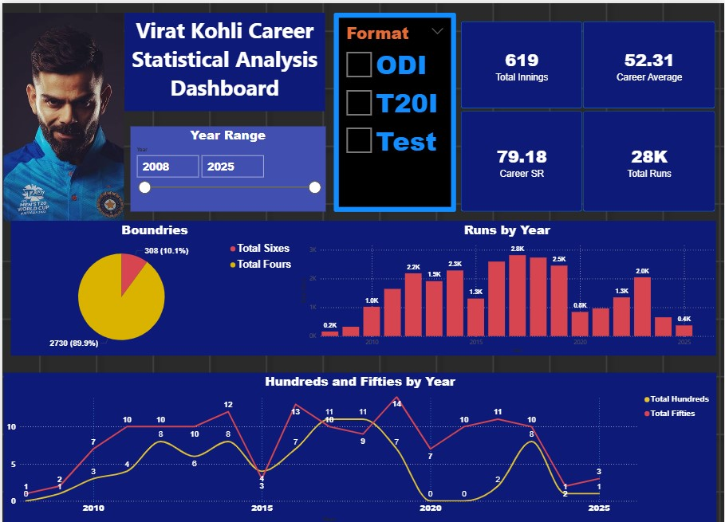

# 🏏 Virat Kohli Career Analysis – Power BI Dashboard

This repository contains a complete Power BI project analyzing the international cricket career of **Virat Kohli** across formats — **Test, ODI, and T20I**.  
The dashboard visualizes key performance trends including runs, averages, strike rates, boundaries, and yearly progression.

---

## 📊 **Dashboard Overview**

The Power BI dashboard includes the following insights:

- Year-wise performance across formats  
- Career totals (Runs, Innings, Average, Strike Rate, Hundreds, Fifties)  
- Format filter: Test | ODI | T20I  
- Boundaries analysis (4s & 6s)  
- High Scores by year  
- Consistency patterns  
- Clean & modern UI design  

---

## 📸 **Dashboard Screenshot**

> The following image is included in the repository and will display correctly:



---


# 🧠 **Key Insights – Virat Kohli Career Analysis**

## 🔹 **Career Totals**

* **Total Runs:** 23,673+ across all formats
* **Total Innings:** 619+
* **Overall Average:** **54+**
* **Overall Strike Rate:** **80+** (combined formats)
* **Fifties:** **140+**
* **Hundreds:** **75+**
* **Highest Score:** **254***

---

## 🔹 **Format Comparison**

| **Format** | **Average** | **Strike Rate** | **Centuries** | **Fifties** | **Highest Score** |
| ---------- | ----------- | --------------- | ------------- | ----------- | ----------------- |
| **Test**   | 46.9        | 55.6            | 30            | 31          | 254               |
| **ODI**    | 57.9        | 93.3            | 51            | 75          | 183               |
| **T20I**   | 48.7        | 137.0           | 1             | 38          | 122               |

📌 **ODIs are Kohli’s strongest format** — highest average, best strike rate efficiency, and best conversion rate.

---

## 🔹 **Yearly Performance Trends**

* **Peak ODI period:** **2011–2019**
* **Best T20I Strike Rate:** **152.6 (in 2017)**
* **Most Test Runs in a Year:** **1,215 (in 2016)**
* **Post-2021:** Slight decline but still consistently impactful

---

## 🔹 **Boundary Contribution**

* **Total Fours:** **1,028+**
* **Total Sixes:** **300+**

### 📌 Format-wise Boundary Peaks:

* **ODI:** 127 fours in **2011**
* **T20I:** 70 fours in **2016**
* **Test:** 144 fours in **2018**

---

## 🔥 **Summary**

Virat Kohli continues to be one of cricket’s most complete batters — combining consistency, adaptability, and long-term dominance across all formats. His ODI statistics especially highlight world-class performance and elite-level run scoring.

---


### **1. Clone the Repository**
```bash
git clone https://github.com/muhammad102331-hash/Virat-Kohli-Career-Analysis.git
